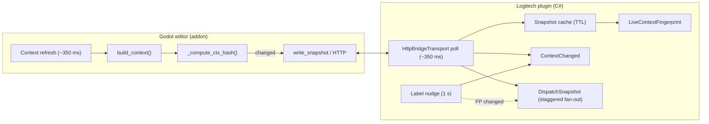

# Live context updates (Godot ↔ Logitech plugin)

This document describes how **editor state** in Godot flows to the **Logitech Actions plugin** so on-device actions (dials, touch keys, folders) can stay in sync with what you see or manipulate in the editor. It covers the HTTP bridge, caching, fingerprints, and the observer-style APIs you should use when building new actions.

## Architecture at a glance

- **Godot** builds a dictionary of editor context (selection, Node3D transforms, particles, script tab, etc.) and exposes it over **loopback HTTP** (`GET /context`) and accepts events (`POST /events`). The addon may still write **`context.json`** under the bridge directory for debugging or legacy tooling; the **primary** integration for this plugin is **HTTP**, not a separate file-transport class in C#.
- The **plugin** polls that endpoint on a fixed schedule, parses JSON into a **`ContextSnapshot`**, and notifies UI code when **meaningful** state changes—without spamming the device on every tick.

### Plugin startup timing

Polling does **not** start immediately when the plugin assembly loads:

1. **`GodotMxBridgePlugin.Load`** waits **~18 seconds** (configurable in code as `BridgePollStartDelay`) so Logi Plugin Service can finish startup without blocking on loopback HTTP.
2. Then **`HttpBridgeTransport.Start()`** runs and arms its timers with **`BridgePollSchedule.InitialDelayMs` (6000 ms)** before the **first** `PollConnection`—again avoiding synchronous HTTP on the first moments after `Start`.

So the first successful poll can occur roughly **24 s** after plugin load (18 s + 6 s), after which the **~350 ms** period applies. Adjust those constants in `GodotMxBridgePlugin.cs` and `BridgePollSchedule.cs` if you change startup behavior.

---

## 1. Godot side: when context is written

The addon refreshes context on a timer aligned with the plugin poll (see `plugin.gd` / `MXContextBus`).

1. **`build_context()`** — Collects main screen, play state, Node3D snapshot, particles, script file name, selection paths, etc.
2. **`_compute_ctx_hash(ctx, options)`** — Computes a small integer hash of the fields that matter for the bridge. If the hash equals the previous one, the addon **skips `write_snapshot`** to avoid rewriting identical JSON (less disk / IPC noise).
3. If the hash changed, the addon writes the snapshot (and may push JSON to the HTTP bridge service).

**Takeaway:** Skipping writes on Godot when nothing logical changed is **orthogonal** to the C# fingerprint; both sides aim to reduce redundant work. Keep the two hash strategies aligned over time if you add new user-visible fields (see §5).

---

## 2. Plugin side: `HttpBridgeTransport`

### 2.1 Polling schedule (`BridgePollSchedule`)

- **`PeriodMs` (350 ms)** — Background timer drives **`PollConnection`**, which performs **`GET http://127.0.0.1:<port>/context`**, parses the payload, and updates an in-memory **`ContextSnapshot`**.
- **`InitialDelayMs` (6000 ms)** — Used **after** `HttpBridgeTransport.Start()` (see **Plugin startup timing** above); defers the first poll inside the transport so the first `Start` window does not hit HTTP immediately.

The poll is the **single authoritative “heartbeat”** for fresh context from the editor (for this design).

### 2.1.1 Reachability

`HttpBridgeTransport` raises **`GodotServiceReachableChanged(bool)`** when the loopback service stops responding vs becomes reachable again. `GodotMxBridgePlugin` subscribes and maps that to **plugin status** (error / normal) so the host UI can show setup help when Godot is not serving `/context`.

### 2.2 Snapshot cache

`TryReadSnapshot` returns a cached `ContextSnapshot` if it is **younger than** a short TTL (**500 ms**, `SnapshotCacheTtlMs` in `HttpBridgeTransport`). That lets many actions and folders call `TryReadSnapshot` in the same poll window **without** one HTTP request per control.

- **`RequestFreshSnapshot()`** — Marks the cache invalid so the **next** `TryReadSnapshot` forces a new HTTP GET. Use sparingly (e.g. diagnostics or forced refresh).

### 2.3 `LiveContextFingerprint`

`LiveContextFingerprint.Compute(ContextSnapshot)` builds a **stable hash** of the fields that drive on-device labels (transforms, node path, particles, script tab, tilemap, etc.), with **rounding** on floats so tiny noise does not flip the hash.

`PollConnection` compares:

- Raw context / options strings (from JSON), and  
- The **fingerprint**,

and **returns early** without notifying if **both** the raw payload and the fingerprint match the last poll—so you do not get redundant UI updates when nothing meaningful changed.

---

## 3. Observer-style APIs: what to subscribe to

### 3.1 `IBridgeTransport.ContextChanged`

- **Raised when:**  
  - A **poll** detects new context (raw JSON or fingerprint changed), **or**  
  - The **label nudge** timer (~1 s, when Godot is reachable) invalidates the cache and asks subscribers to refresh—so dynamic UIs that only redraw on events still update periodically even if TTL would otherwise serve stale cache.

- **Use for:** Commands, folders, or adjustments that should react to **any** “something may have changed” signal, including the periodic nudge (similar in spirit to a clock button refreshing once per second).

- **Handler pattern:** In the handler, call **`TryReadSnapshot(out var snap)`** and update labels / `AdjustmentValueChanged` / `ActionImageChanged` as needed.

### 3.2 `IBridgeTransport.PresentationTargetChanged`

- **Raised when:** The **identity** of the primary editable target changes (e.g. selected **Node3D path** or `HasNode3d` flips), **not** on every numeric tweak.
- **Use for:** Resetting titles, icons, or “which node am I editing?” state without reacting to every transform delta (though the poll still delivers those when the fingerprint changes).

### 3.3 `IGodotContextSubscriber` + `GodotContextBroadcastService.DispatchSnapshot`

- **No extra HTTP poll here.** After each successful poll, if the transport decides that live UI state changed (`shouldNotify`), it invokes **`ContextChanged`** and **`GodotContextBroadcastService.DispatchSnapshot(snapshot)`** with the **same** `ContextSnapshot` already parsed and cached for that poll. **`DispatchSnapshot`** then notifies subscribers **one at a time**, spaced by **`BridgePollSchedule.ContextSubscriberStaggerMs`** (default 8 ms), so many controls are not repainted in a single synchronous burst.
- **Label nudge (~1 s):** **`ContextChanged`** still fires so broad listeners can refresh cached readouts. **`DispatchSnapshot`** runs **only** if **`LiveContextFingerprint`** of the freshly read snapshot **differs** from the last fingerprint seen by the poll (same rule as coalescing)—not on every nudge tick.

- **Use for:** Encoders or actions that need **live** values tied to editor state **without** redundant wakeups when nothing logical changed. Implement **`IGodotContextSubscriber`**, call **`GodotContextBroadcastService.Subscribe(this)`** in `OnLoad` and **`GodotContextBroadcastService.Unsubscribe(this)`** in `OnUnload`, and implement **`OnGodotContextSnapshot(ContextSnapshot snapshot)`** using the passed snapshot (no extra HTTP). Prefer **local diff** before `ActionImageChanged` / `AdjustmentValueChanged` when only a subset of fields affects the control.

Reference implementation: **`NodeTransformAxisAdjustmentBase`** (reconcile pending reset, hydrate presentation hint, `AdjustmentValueChanged`, etc.).

---

## 4. Choosing a strategy

| Goal | Mechanism |
|------|-----------|
| Broad refresh, OK with ~1 s nudge | `ContextChanged` + `TryReadSnapshot` in handler |
| “Which node / target” only | `PresentationTargetChanged` |
| Live values, poll cadence, **no** nudge spam on identical state | `IGodotContextSubscriber` + `DispatchSnapshot` |
| User turned a dial / pressed a key | Your action’s `ApplyAdjustment` / `RunCommand` already runs; optionally call `AdjustmentValueChanged` after local updates |

---

## 5. Extending “what counts as a change”

When you add new **user-visible** state:

1. **Godot** — Include it in `build_context` and in **`_compute_ctx_hash`** if the bridge should receive new files / HTTP payloads when that state changes. Keep this hash aligned with what you add on the C# side: today **`_compute_ctx_hash`** does not include every field that **`LiveContextFingerprint`** includes (for example **`script_file`** is parsed in C# but omitted from the GDScript hash), which can cause redundant writes or missed skips—extend both when you add user-visible state.
2. **C#** — Map it in **`BridgePayloadParser`** / **`ContextSnapshot`**, then add it to **`LiveContextFingerprint.Compute`** so polls and fingerprints stay consistent.

Avoid hashing raw JSON strings for the fingerprint unless you accept formatting noise; **structured fields + rounding** match what users see on the device.

---

## 6. Related source files (plugin)

| Area | Files |
|------|--------|
| Plugin load + deferred `Start` | `Core/GodotMxBridgePlugin.cs` |
| HTTP poll, cache, events | `Bridge/HttpBridgeTransport.cs`, `Bridge/BridgePollSchedule.cs` |
| Fingerprint | `Bridge/LiveContextFingerprint.cs` |
| Subscriber fan-out | `Bridge/GodotContextBroadcastService.cs`, `Bridge/IGodotContextSubscriber.cs` |
| Presentation helpers | `Bridge/BridgePresentation.cs` |
| Example consumer | `Adjustments/NodeTransformAxisAdjustmentBase.cs` |

Godot addon: context build and `_compute_ctx_hash` live under **`Godot-MXConsoleAddon`** (e.g. `addons/mx_creative_console/plugin.gd`, `core/mx_context_bus.gd`).

---

## 7. Summary

- **Deferred startup** (~18 s plugin delay + 6 s transport delay) then **one fast poll** (~350 ms) keeps the plugin aligned with the editor; **fingerprinting** avoids useless UI work when logical state is unchanged.
- **`ContextChanged`** is the wide net (includes periodic label nudge).
- **`IGodotContextSubscriber`** receives **`DispatchSnapshot`** when the poll (or nudge with a **new fingerprint**) detects a logical change—**not** on every nudge; deliveries are **staggered** across subscribers. **`ContextChanged`** remains the wider net (includes periodic nudge) and still runs **immediately** with the poll.
- Keep Godot’s **write hash** and the C# **fingerprint** in mind together when you evolve the schema so both sides stay coherent.
